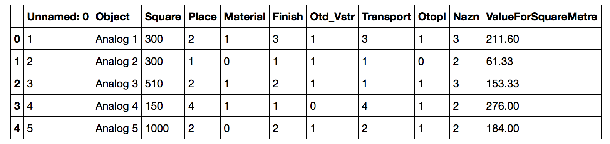
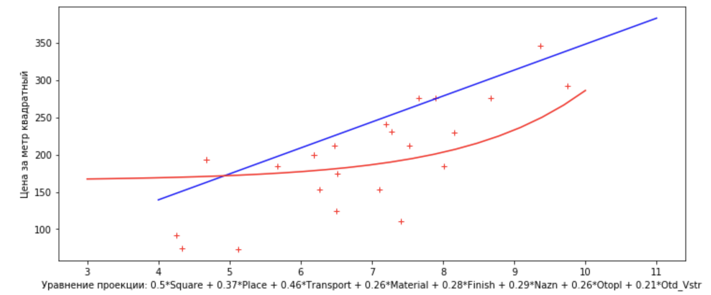

# Оценка недвижимости

   Цель данного проекта состоит в том, чтобы построить и продемонстрировать математическую модель, 
   которая может быть     использована оценщиками для оценки нежилого имеущества(например, 
   предсказания стоимости квадратного метра заданного объекта)
 
 # Входные данные
  
   На вход каждая модель получает датафрейм, содержащий аналоги(исходные объекты) и их признаки, 
   такие как: Площадь, Состояние объекта, Местоположение и т.д. 
   Пример входных данных содержится в файле General_Table_3.csv
   
   
  
  # Результат
    
   Построенная и протестированная модель содержится в файле Cost.ipynb
   
   
   
    
    
  
